## 🚀 Proyecto frontend desarrollado en React como trabajo final del diplomado

El enfoque principal fue la arquitectura de componentes, manejo de estado,
consumo de servicios backend y buenas prácticas en desarrollo frontend.

## 📌 Descripción
Aplicación web desarrollada en React.  
El backend fue provisto por el docente (Java) y mi responsabilidad fue el
desarrollo completo del frontend.

## 🛠️ Tecnologías
- React
- JavaScript
- HTML
- Bootstrap / CSS
- Consumo de servicios backend

## 🎯 Funcionalidades
- Login de usuarios
- Formularios
- Creación, edición, eliminación y actualización de profesores
- Creación, asignación, actualización y eliminación de cursos
- Manejo de estados
- Navegación entre vistas

## 📷 Capturas

### Login
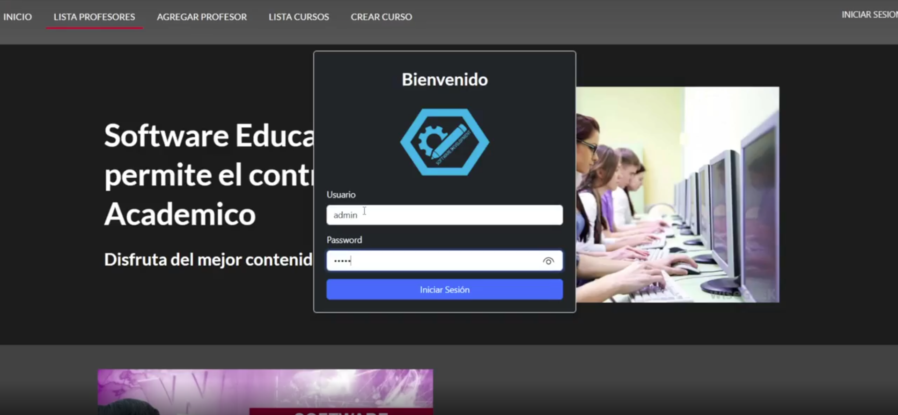

### Inicio correcto del sistema
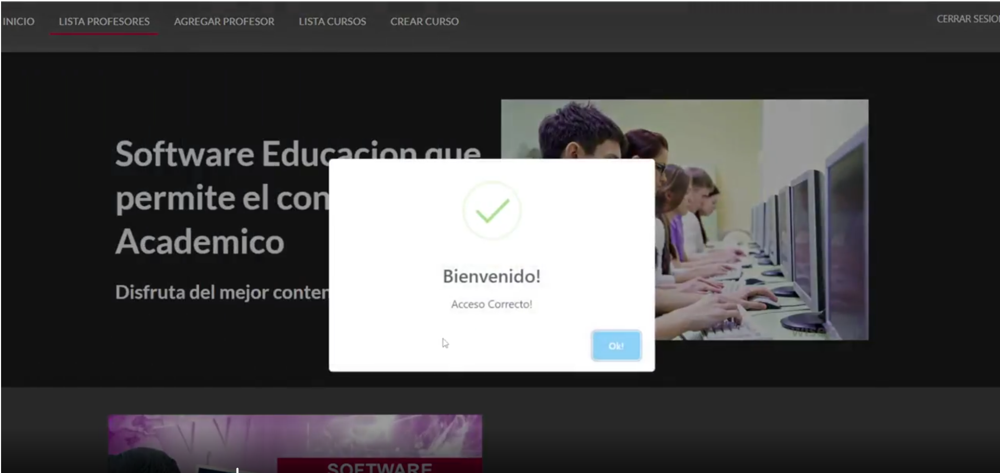

### Creación de registro de profesor
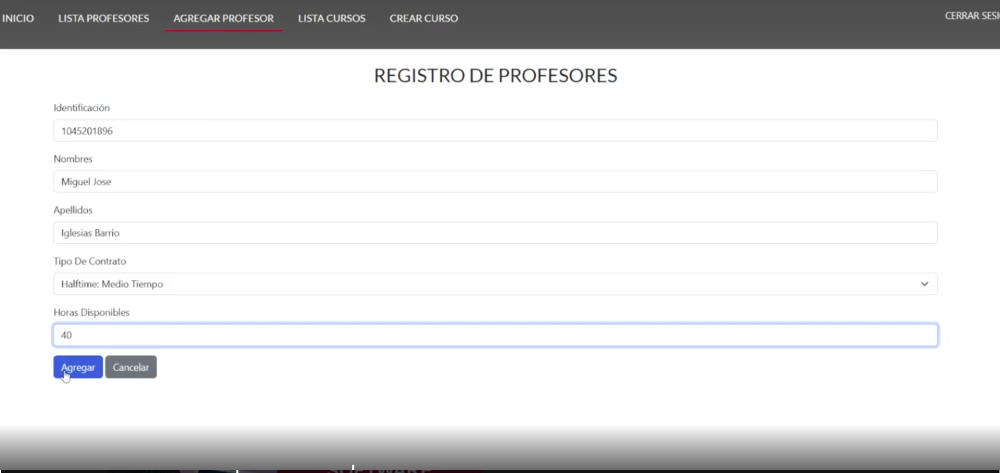
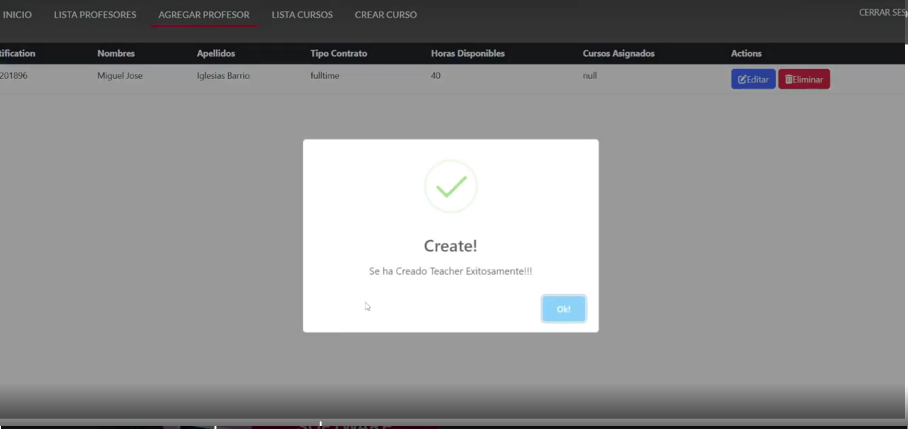

### Listado de profesores
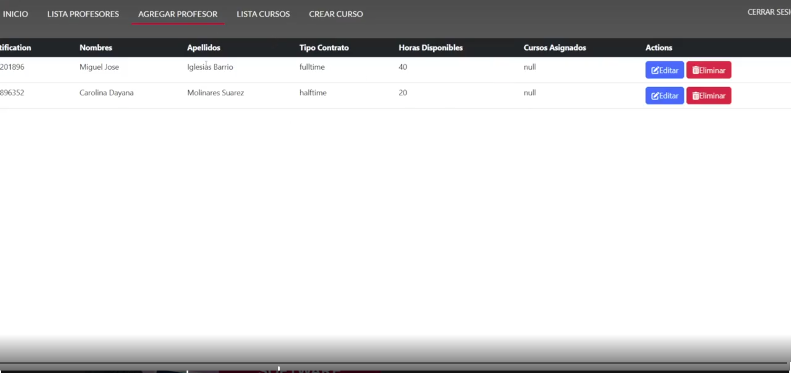

### Eliminación de profesor
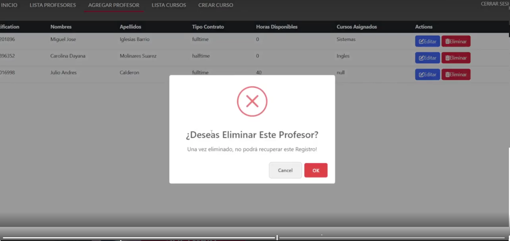

---

### Creación de curso
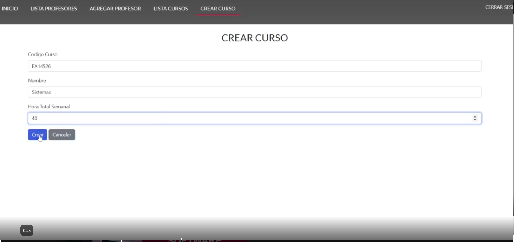
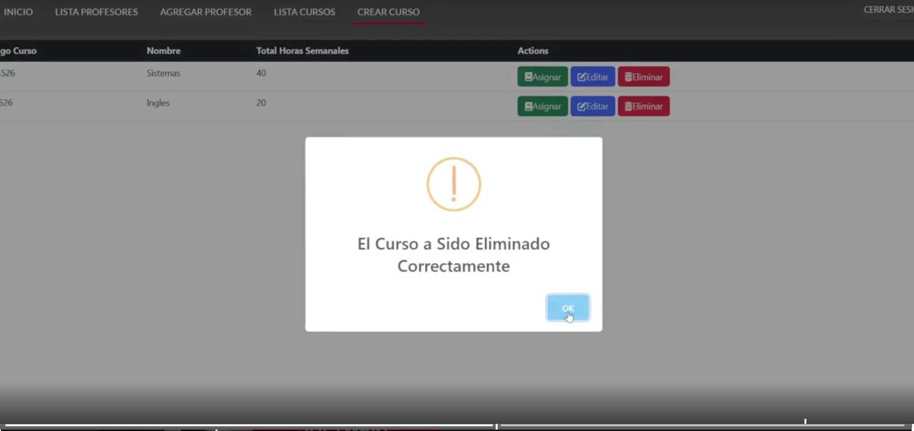

### Listado de cursos
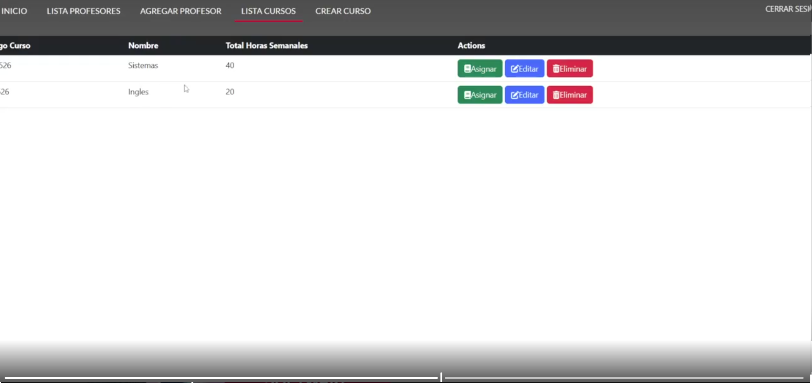

### Asignación de curso
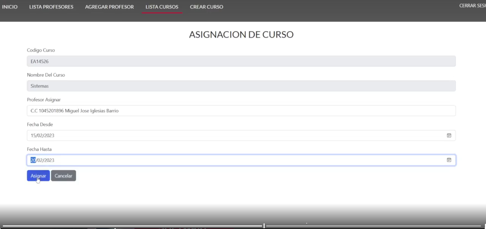

### Eliminación de curso
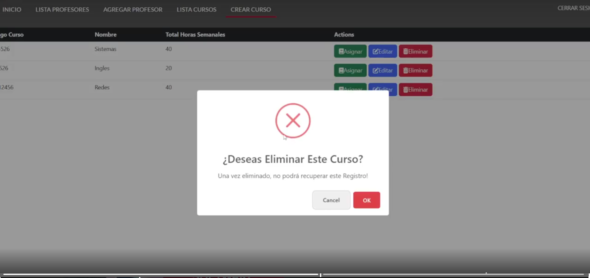

---

### Cerrar sesión
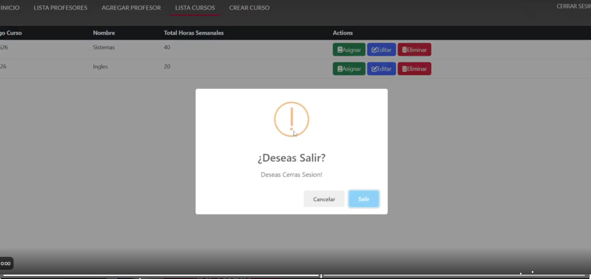

## 🎥 Video de sustentación
[Enlace al video](https://drive.google.com/file/d/1Qc6MkLfs-4AqhY8riYVj89b0zICpAn78/view)

## 🧠 Nota
Proyecto académico orientado al fortalecimiento de habilidades en desarrollo frontend con React.
